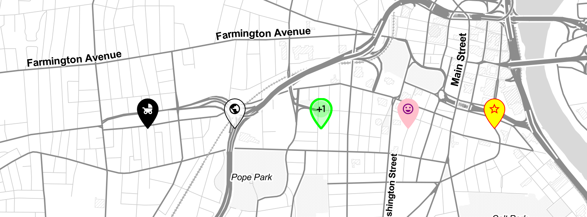

# Leaflet.IconMaterial
Just another shameless copy of Awesome-Markers, but this time with [Material Icons](https://material.io/tools/icons/) icons and customizable `fill` and `outline` colors of the marker.



## Using the plugin
1. Include Material Icons web font in your application. See [Google's Guide](https://google.github.io/material-design-icons/) to learn many ways of doing it. But most likely you will end up with something like that in the `<head>` of your HTML:
```html
<link href="https://fonts.googleapis.com/icon?family=Material+Icons" rel="stylesheet">
```

2. Next, include `Leaflet.IconMaterial`'s JavaScript and CSS:

```html
<link href="css/leaflet.icon-material.css" rel="stylesheet">
<script src="js/leaflet.icon-material.js"></script>
```

or

```
npm i leaflet-iconmaterial
```

3. Create a Material icon and add it to your Leaflet map
```js
  // Create a semi-transparent bus icon
  var busIcon = L.IconMaterial.icon({
    icon: 'directions_bus',            // Name of Material icon
    iconColor: '#aa2187',              // Material icon color (could be rgba, hex, html name...)
    markerColor: 'rgba(255,0,0,0.5)',  // Marker fill color
    outlineColor: 'yellow',            // Marker outline color
    outlineWidth: 1,                   // Marker outline width 
    iconSize: [31, 42]                 // Width and height of the icon
  })
  
  // Attach the icon to the marker and add to the map
  L.marker([41.76,-72.67], {icon: busIcon}).addTo(map)
```

## Credits
1. Shamelessly adapted from [Leaflet.AwesomeMarkers](https://github.com/lvoogdt/Leaflet.awesome-markers) by @lvoogdt - MIT License
1. SVG and other magic by @wesleyvandevoorde from a [never merged pull request](https://github.com/lvoogdt/Leaflet.awesome-markers/pull/74)
1. [Material Icons](https://github.com/google/material-design-icons) by Google - Apache-2.0 license.
